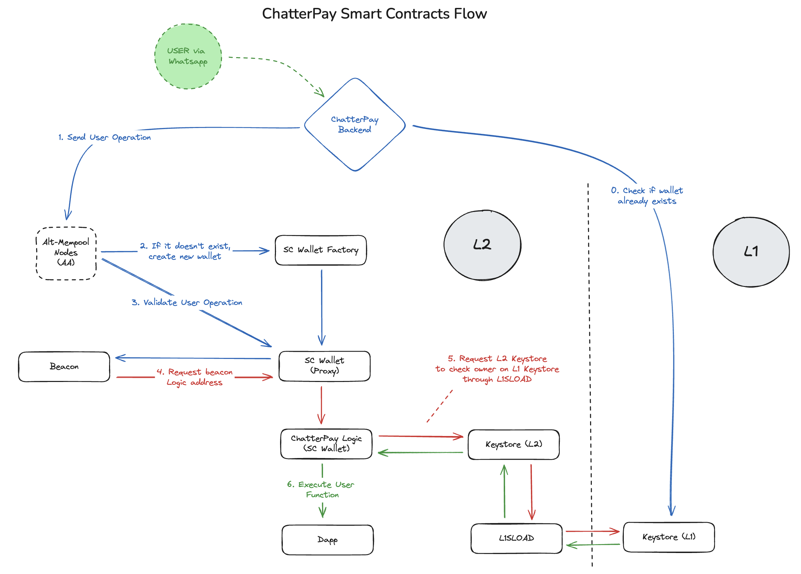

# ChatterPay Contracts Overview

## Summary

These smart contracts collectively create a robust ecosystem for wallet management, token price feeds, and NFT handling. They provide flexibility, upgradeability, and security by implementing key features like account abstraction, secure wallet deployment, NFT minting, and real-time price data management. The system allows for efficient wallet creation, management of user operations, and the minting of original and copy NFTs, all while ensuring that transaction fees and external data feeds are properly handled.

## Contracts List:

1. [**ChatterPay.sol**](../../src/ChatterPay.sol)  
Core wallet contract for ChatterPay, handling user operations, token transfers, and transaction fee management.

2. [**ChatterPayPaymaster.sol**](../../src/ChatterPayPaymaster.sol)  
Fee manager contract that ensures transaction fees are paid on behalf of users, supporting the account abstraction model of ChatterPay.

3. [**ChatterPayNFT.sol**](../../src/ChatterPayNFT.sol)  
Manages the minting of original NFTs and their associated copies, with controls for copy limits and owner management.

4. [**ChatterPayVault.sol**](../../src/ChatterPayNFT.sol)  
Handles secure storage and management of assets within the ChatterPay ecosystem, providing vault services for users.

5. [**ChatterPayWalletFactory.sol**](../../src/ChatterPayWalletFactory.sol)  
A wallet factory contract that creates proxy wallets for users, tracks proxies, and allows for updates to wallet implementations.

6. [**ChatterPayWalletProxy.sol**](../../src/ChatterPayWalletProxy.sol)  
A proxy contract for ChatterPay wallets, allowing for upgradeable wallet functionality using [ERC-1967 Proxy](https://docs.openzeppelin.com/contracts/4.x/api/proxy#ERC1967Proxy), and providing a method to retrieve the current wallet implementation.

7. [**SimpleSwap.sol**](../../src/SimpleSwap.sol)  
Implements a simple token swapping mechanism, allowing users to swap between supported tokens within the ChatterPay ecosystem.

8. [**USDT.sol**](../../src/USDT.sol)  
A contract representing the USDT (Tether) token on Layer 2, enabling stablecoin transactions within the ChatterPay platform.

9. [**WETH.sol**](../../src/WETH.sol)  
A contract for wrapping and unwrapping ETH as WETH (Wrapped Ether), allowing users to interact with ETH as an ERC-20 token in the ChatterPay ecosystem.

10. [**PackedUserOperation.sol**](../../src/utils/PackedUserOperation.sol)  
Defines the structure for user operations, including details like gas limits, fees, and operation signatures, enabling flexible interaction with the wallet system.

11. [**L1Keystore.sol**](../../src/Ethereum/L1Keystore.sol)  
Stores wallet data on Layer 1, managing user accounts, wallet registrations, and key-value storage, with access control for key updates.

12. [**TokensPriceFeeds.sol**](../../src/Ethereum/TokensPriceFeeds.sol)  
Reads and manages token price feeds (ETH/USD, BTC/USD) from external proxy contracts, ensuring the data is up-to-date and valid.

Representation of Chatterpay's Smart Contracts Flow:

[Here](./contracts-details.md) you can see a detailed breakdown of the provided smart contracts used for ChatterPay. 
